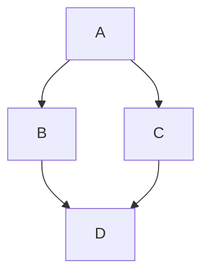

A short, engaging introduction to your blog post. This part appears in the blog post list view.

{/* truncate */}

The rest of your content goes here.

## Reusable Components Examples

### Callout Boxes (Admonitions)

:::tip Pro Tip
This is a tip admonition. You can also use `:::note`, `:::info`, `:::warning`, and `:::danger`.
:::

### Code Tabs

import Tabs from '@theme/Tabs';
import TabItem from '@theme/TabItem';

<Tabs>
  <TabItem value="apple" label="Apple" default>
    This is an apple 🍎
  </TabItem>
  <TabItem value="orange" label="Orange">
    This is an orange 🍊
  </TabItem>
  <TabItem value="banana" label="Banana">
    This is a banana 🍌
  </TabItem>
</Tabs>

### Architecture Diagrams (Mermaid)

