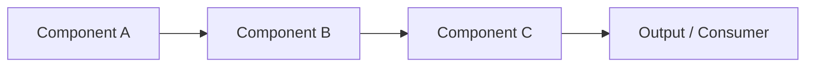

import CaseStudyHeader from '@site/src/components/CaseStudyHeader';

CASE STUDY — 0X

# [Case Study Title]

<CaseStudyHeader
  number="0X / 03"
  role="Staff Software Engineer — Platform Lead"
  duration="YYYY – YYYY"
  stack={['Tool A', 'Tool B', 'Tool C']}
  impact="[One sentence on the business outcome]"
/>

  [2–3 sentences on the situation and what changed. Write for someone who doesn't know the company.]

  

    X%
    Outcome label
  

  

    Xk+
    Scale metric
  

  

    Xms
    Performance metric
  

---

Context

## The Situation

[What was true before you arrived or before this initiative. What was the organization doing instead?
Be specific about scale, team size, frequency of pain. Avoid jargon — describe the lived experience.]

---

Architecture

## System Design

---

The Problem

## What Was Breaking

[Technical + business framing. What was the failure mode? What did it cost — in time, reliability,
developer experience, or revenue? Quantify wherever possible.]

---

Constraints

## What I Couldn't Do

[What you were NOT allowed to do — budget ceilings, team size, timeline pressure, migration risk,
political constraints. This section signals maturity. It shows you operated in the real world,
not a greenfield.]

---

Strategic Solution

## The Decision

[Your architectural choice. What alternatives did you consider? Why did you reject them?
What made your approach correct for this specific context?]

---

Execution

## Implementation

[Key milestones and phases. Technical decisions made during execution. What surprised you?
What had to change mid-flight?]

---

Outcomes

## Results

  

    X%
    Primary outcome metric
  

  

    X
    Secondary metric
  

[Narrative on results — what changed for teams, customers, or the business? What's different now?]

---

Retrospective

## What I'd Do Differently

[Honest reflection. What would you change? What did you learn that you didn't know at the start?
This section is often what separates a principal-level portfolio from a senior one.]
