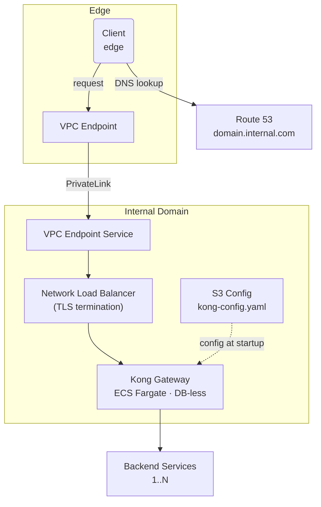

import CaseStudyHeader from "@site/src/components/CaseStudyHeader";

CASE STUDY — 01

# Cloud Native API Gateway

<CaseStudyHeader
  number="01 / 03"
  role="Staff Software Engineer — Platform Lead"
  duration="2025 – Present"
  stack={['Kong', 'Terraform', 'AWS EKS', 'Istio', 'Envoy', 'GitHub Actions']}
  impact="Became the organizational standard for cross-domain connectivity at Twilio, serving 3M+ RPS with five-nines availability."
/>

  How a Kong-based Domain Gateway became the foundational communication layer
  for Twilio's core service domains — running DB-less on ECS Fargate, exposed
  through AWS PrivateLink, and consumed as a self-service Terraform module.

  

    3.39M
    Aggregate Requests / Second
  

  

    768.48B
    Total HTTP Requests Tested
  

  

    96.33% → 99.999%
    Endpoint Reliability
  

  

    Minutes
    To Onboard New Gateway
  

A large-scale cloud communications platform required a standardized, high-performance API
gateway to enable secure cross-domain communication across its core service domains. I led the
design, planning, and implementation of a Kong-based domain gateway infrastructure that now serves
as the foundational communication layer for the platform's core domains. The system is prepared to
handle more than **3.39 million aggregate requests per second** under stress, has processed
**768.48 billion total HTTP requests** in comprehensive performance testing, and improved endpoint
reliability from **96.33% to 99.999%** following NLB+ALB hardening. Built on Amazon ECS Fargate in
DB-less mode, the infrastructure is exposed through AWS PrivateLink for secure, private
cross-account connectivity.

---

The Challenge

## Cross-Domain Communication at Scale

As the platform expanded, its core service domains required a reliable, low-latency mechanism to
communicate with each other and with external edge services. Without a unified gateway layer, each
domain team was independently solving routing, TLS termination, and service discovery — leading to
fragmented approaches, inconsistent reliability, and operational overhead that scaled linearly with
the number of domains.

The system needed to handle millions of requests per second while maintaining sub-second recovery
times during infrastructure failures. Any downtime or degradation in cross-domain communication had
a direct impact on customer-facing products.

### Legacy Integration Constraints

The infrastructure landscape was mixed. Communication paths spanned cloud-native workloads and
non-cloud-native platforms, including a Kubernetes-based platform and a legacy VM-based platform. A
gateway solution had to bridge these worlds without requiring wholesale migration of legacy systems.
Previous incidents underscored the urgency: an EC2 instance failure caused edge 503 errors, and the
existing architecture lacked the resilience to absorb such failures gracefully. Pre-hardening
metrics showed a **96.33% success rate during the time window of the incident** — an unacceptable
reliability profile for production traffic.

### Operational Requirements

Beyond raw performance, operational concerns shaped the requirements. Domain teams needed a
self-service model for deploying and configuring gateways without deep infrastructure expertise.
Performance testing required dedicated tooling: previously, each engineer had to write custom test
code and provision infrastructure independently, creating a high barrier to validation. DNS
management across multiple platforms introduced blast radius concerns, where a single
misconfiguration could cascade across unrelated services.

---

Architecture

## System Design

The deployment follows a provider-consumer model across two AWS accounts. The Edge account resolves
a private DNS name and connects over PrivateLink to the Domain account, where a Network Load Balancer
fronts Kong running on ECS Fargate. Kong routes requests to the appropriate backend services.

### Design Principles

The architecture was governed by four principles derived directly from the challenges above:

1. **Mesh-less simplicity** — Avoid the operational complexity of a full service mesh by deploying
   Kong as a lightweight, per-domain gateway.
2. **Platform-agnostic connectivity** — Design DNS and networking to work across legacy VM-based,
   Kubernetes, and cloud-native platforms without coupling to any single infrastructure model.
3. **Self-service consumption** — Publish the gateway as a Terraform module that domain teams
   consume with minimal configuration.
4. **Defense in depth** — Layer security controls from network isolation (PrivateLink) through TLS
   termination to least-privilege IAM.

### Key Components

**Kong Gateway** operates in DB-less mode, eliminating the need for a database cluster and the
operational burden that comes with it. Declarative YAML configuration is stored in an S3 bucket and
fetched at startup by an init container, ensuring that each task boots with a consistent, versioned
configuration.

**Init Container Pattern** separates concerns at startup. The `s3-config-downloader` container
retrieves the gateway configuration from S3 and writes it to a shared volume. An optional
`plugin-manager` container loads custom Lua and Go plugins from an approved ECR registry. ECS mounts
these volumes into the Kong container at launch, enabling zero-downtime configuration updates through
task replacement.

**Observability Stack** includes an OTEL collector sidecar that scrapes Prometheus metrics from Kong
and exports them via OTLP to Grafana. All container logs are shipped to CloudWatch. Health checks on
`/status/ready` (port 8100) at 30-second intervals provide liveness and readiness signals to the
load balancer.

---

Strategic Solution

## The Terraform Paved Road

The entire gateway stack is implemented as a reusable Terraform module published to S3 for
consumption by domain teams. This module includes custom providers to meet the organization's
operational excellence standards. Each domain deploys its own isolated gateway instance by
referencing the module and providing domain-specific configuration — giving domain teams ownership
of their gateway lifecycle while enforcing consistent infrastructure patterns across the
organization.

The ECS task definition allocates **1 vCPU and 4096 MiB of memory** per Kong container by default.
Security groups enforce a strict ingress model, continuous health-check traffic to evacuate fast in
case of failures, and Strong Identity (SPIFFE) for clear authentication and authorization. Any other
inbound traffic is denied. IAM roles follow least-privilege principles, granting only S3 read
permissions for the configuration bucket.

### Deployment and Resilience

The module supports four deployment strategies — Rolling (default), Blue/Green, Linear, and Canary —
giving domain teams flexibility to match their risk tolerance. A circuit breaker with automatic
rollback is enabled by default, ensuring that failed deployments are reverted without manual
intervention.

Auto-scaling adjusts the number of running tasks based on CPU and memory utilization, with higher
minimums in production than in non-production environments. Cooldown periods are tuned to scale out
quickly during traffic spikes while scaling in more conservatively to avoid reacting to short-lived
dips. The gateway is deployed across multiple availability zones so that the loss of any single zone
does not take it down.

### DNS and Connectivity

A platform-agnostic DNS infrastructure was designed under a dedicated internal namespace, using a
structured `<service>.<region>.<env>` naming convention. DNS delegation occurs at the domain level
rather than at the zone apex, reducing the blast radius of DNS failures to a single domain rather
than the entire namespace.

Cross-account connectivity uses AWS PrivateLink through VPC Endpoint Services. Dedicated Terraform
modules manage the private links with a RAM share approach and SSM parameters for endpoint
discovery. This design keeps traffic on the AWS backbone, avoids internet traversal, and provides
network-level isolation between consumer and provider accounts.

TLS termination occurs at the NLB using ACM certificates, with traffic forwarded to Kong over port
8000. gRPC support was enabled through coordination between domain owners and the edge team,
extending the gateway's protocol coverage beyond HTTP/REST.

### Performance Validation

The team built an on-demand performance testing tool based on k6 and Helm. Previously, each team
member had to write custom test code and stand up dedicated infrastructure for performance
validation. With the new tool, anyone can execute comprehensive load tests with two standard
commands. It was later adopted by the edge team for their own proxy testing, broadening its impact
beyond the original gateway project.

---

Organizational Impact

## What Changed

Stress testing reached **3.39 million aggregate requests per second**, demonstrating that the system
can absorb peak traffic well beyond current production requirements. Comprehensive performance
testing processed **768.48 billion total HTTP requests** without degradation in error rate or
latency, confirming the stability of the DB-less Kong configuration, the auto-scaling policy, and
the underlying ECS Fargate infrastructure.

| Dimension              | Before                      | After                                |
| ---------------------- | --------------------------- | ------------------------------------ |
| Gateway onboarding     | Weeks of custom development | Minutes via `terraform apply`        |
| Endpoint reliability   | 96.33% during incident      | 99.999% after NLB+ALB hardening      |
| Performance validation | Days of custom development  | Two commands, minutes of execution   |
| Operational visibility | Fragmented per gateway      | Unified via OpenTelemetry pipeline   |
| Config drift           | Frequent snowflakes         | Zero — module is the source of truth |

The self-service Terraform module eliminated the need for domain teams to build and maintain bespoke
gateway infrastructure. A governed Kong plugin monorepo established a controlled workflow for custom
plugin development, enabling teams to extend gateway functionality through Lua and Go plugins without
risking the stability of the shared platform. A domain-level DNS delegation model, combined with a
platform-agnostic internal namespace, created a connectivity model that works uniformly across
legacy VM-based, Kubernetes, and cloud-native platforms — resolving the fragmentation that previously
required per-platform integration work.

---

Key Technical Decisions

## Why It Was Built This Way

| Decision                                              | Rationale                                                                                                                                      |
| ----------------------------------------------------- | ---------------------------------------------------------------------------------------------------------------------------------------------- |
| Kong DB-less mode with S3-backed config               | Eliminates database operational overhead; declarative config enables versioning, rollback, and GitOps workflows                                |
| ECS Fargate over EC2                                  | Removes host management burden; aligns with a serverless-first container strategy                                                              |
| AWS PrivateLink for cross-account connectivity        | Keeps traffic on the AWS backbone; provides network-level isolation without VPC peering complexity                                             |
| Init container pattern for config and plugins         | Separates boot-time concerns from runtime; enables independent update cycles for config and plugins                                            |
| NLB with TLS termination over ALB                     | Layer 4 performance with TLS/ALPN negotiation for gRPC; required as PrivateLink target (ALB is not supported as a VPC Endpoint Service target) |
| Asymmetric auto-scaling cooldowns (60s out / 300s in) | Prioritizes fast response to traffic spikes while preventing flapping during transient load dips                                               |
| Domain-level DNS delegation                           | Reduces blast radius of DNS misconfigurations to a single domain rather than the entire organization                                           |
| Circuit breaker with automatic rollback               | Prevents bad deployments from fully propagating; reduces mean time to recovery without human intervention                                      |
| Platform-agnostic DNS namespace                       | Decouples service discovery from infrastructure platform; supports migration across legacy VM-based, Kubernetes, and cloud-native platforms    |
| Reusable Terraform module published to S3             | Enables self-service gateway deployment while enforcing consistent security and operational patterns                                           |

---

Technical Implementation

## Stack

- **Core Engine** — Kong Gateway, DB-less mode on Amazon ECS Fargate (1 vCPU / 4096 MiB per task)
- **Edge & Connectivity** — AWS PrivateLink (VPC Endpoint Services), Network Load Balancer with ACM TLS termination
- **IaC** — Reusable Terraform modules published to S3 (gateway, private links, DNS) with custom providers
- **Config & Plugins** — S3-backed declarative YAML, init-container pattern, governed Lua/Go plugin monorepo (ECR)
- **Protocols** — HTTPS/REST and gRPC over PrivateLink
- **Observability** — OpenTelemetry Collector → Prometheus/Grafana, logs to CloudWatch
- **Performance** — On-demand k6 + Helm load-testing tool
