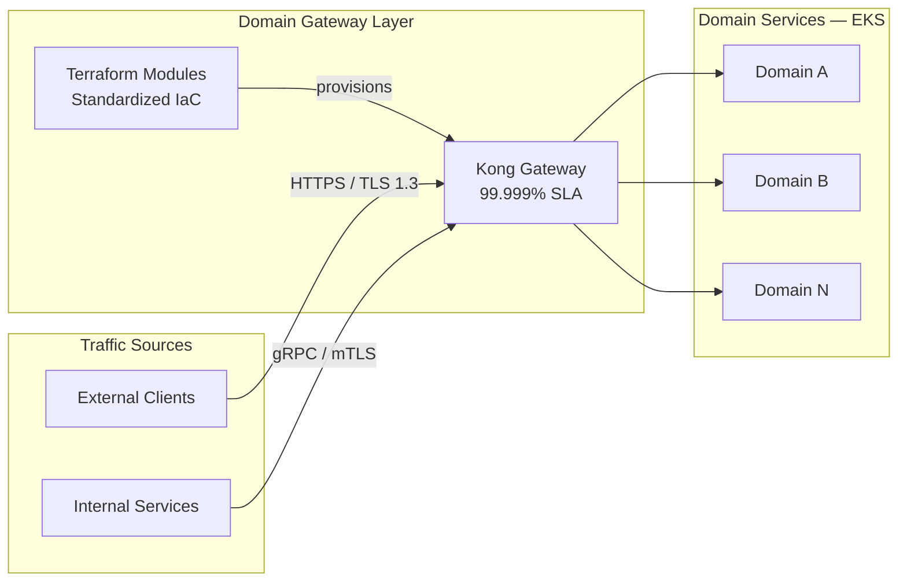

CASE STUDY — 01

# Cloud Native API Gateway

  How a Kong-based Domain Gateway became the organizational standard for cross-domain connectivity
  at Twilio — handling 3M+ RPS with five-nines availability through a Terraform paved road.

  

    3M+
    Requests per Second
  

  

    99.999%
    Availability SLA
  

  

    Minutes
    To Onboard New Gateway
  

  

    TLS 1.3
    Security Baseline
  

---

The Challenge

## Fragmented Connectivity at Scale

As Twilio's service count grew, the lack of a standardized API gateway strategy created compounding
problems. Each domain team independently configured connectivity, leading to:

- **Inconsistent security posture** — some services skipping TLS termination entirely.
- **Protocol fragmentation** — no standard approach to gRPC for high-performance internal traffic.
- **Operational overhead** — every new service required days of manual gateway setup.
- **Snowflake configurations** — impossible to audit, patch, or evolve across the estate.

The organization needed a single, opinionated "paved road" that teams would *want* to adopt.

---

Architecture

## System Design

---

Strategic Solution

## The Terraform Paved Road

The core insight was treating Kong not as infrastructure to *configure* but as a platform to *consume*.
I built versioned Terraform modules that encoded organizational standards — so teams got the right
gateway behavior by default, not by discipline.

Each module enforced:

**Security defaults** — Mandatory TLS 1.3 termination, automated ACM certificate rotation,
and mTLS for internal gRPC traffic. Security was not a configuration option; it was the baseline.

**Traffic management** — Built-in rate limiting, circuit breaking, and health-check patterns
applied automatically to every route. Production traffic could never reach an unhealthy upstream.

**Observability hooks** — Every gateway instance exported a standard set of metrics and access logs
via the OpenTelemetry pipeline, giving the platform team full visibility without per-team instrumentation work.

**Plugin governance** — A custom CI/CD pipeline for testing and delivering internal Kong plugins,
ensuring the plugin ecosystem remained stable and auditable across all gateway instances.

---

Organizational Impact

## What Changed

The impact was felt across three dimensions:

| Dimension | Before | After |
|---|---|---|
| Gateway onboarding | 3–5 days of manual work | Minutes via `terraform apply` |
| Security compliance | Per-team, inconsistent | Enforced at module level |
| Operational visibility | Fragmented per gateway | Unified via OTel pipeline |
| Config drift | Frequent snowflakes | Zero — module is the source of truth |

The gateway layer now handles **3M+ RPS** with **99.999% measured availability**,
serving as the single connectivity fabric for all Twilio domain services.

---

Technical Implementation

## Stack

- **Core Engine** — Kong Gateway (Enterprise) on Amazon EKS
- **IaC** — Terraform custom modules (Gateway, Consumer, Route definitions)
- **Protocols** — HTTPS/TLS 1.3 (external), gRPC/mTLS (internal)
- **CI/CD** — Custom plugin testing and delivery pipelines
- **Observability** — OpenTelemetry Collector → Prometheus/Grafana
