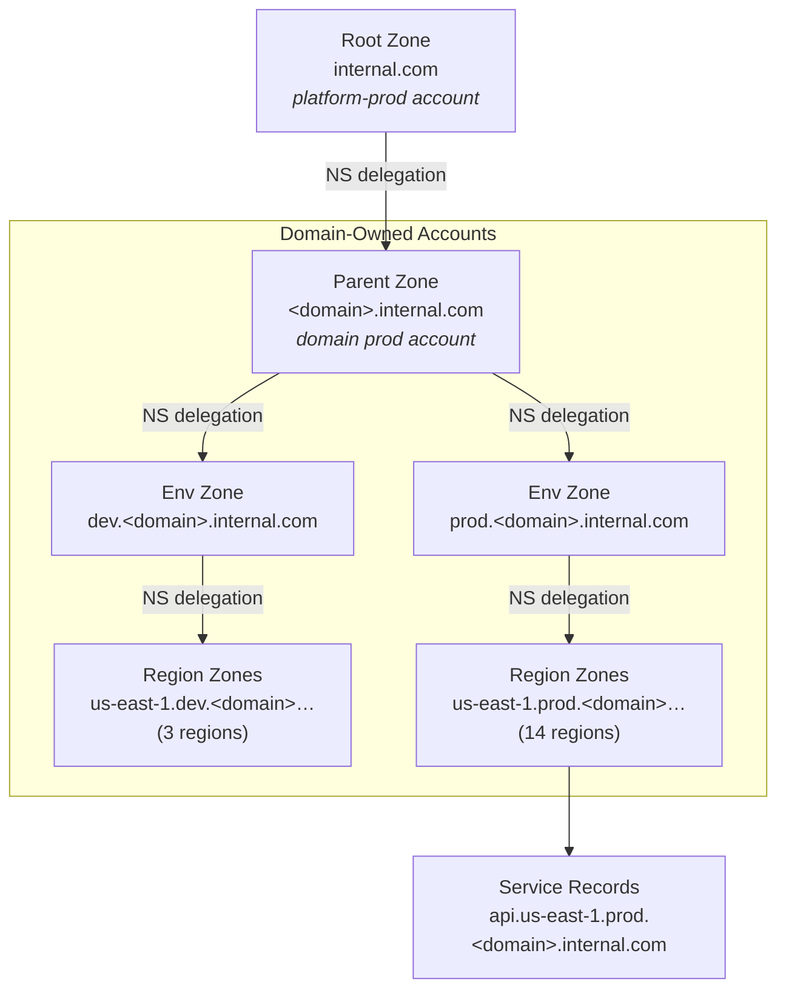

import CaseStudyHeader from "@site/src/components/CaseStudyHeader";

CASE STUDY — 03

# Domain-Based DNS Hierarchy

<CaseStudyHeader
  number="03 / 04"
  role="Staff Platform / Infrastructure Engineer"
  duration="2025 – 2026"
  stack={[
    "Route 53",
    "Terraform",
    "AWS ACM",
    "Jinja2",
    "Python",
    "AWS Multi-Account",
    "Terraform Cloud",
  ]}
  impact="Turned DNS from a centrally-owned operational service into a self-owned platform capability — every domain now discovers its services by name, on any deployment platform, with failure blast radius scoped to a single domain."
/>

  How a centralized DNS boundary became a three-level, domain-owned hierarchy.
  Services are now discoverable by name —{" "}
  <code>api.us-east-1.prod.&lt;domain&gt;.internal.com</code> — each domain
  fully owns its DNS, and service discovery is decoupled from whatever platform
  a workload runs on.

  

    40+
    Domains Onboarded
  

  

    3-Level
    Self-Owned Hierarchy
  

  

    14
    Regions per Production Zone
  

  

    3
    
      Deployment Platforms, One Naming Scheme
    
  

A previous initiative centralized DNS management for the organization's Kubernetes platform,
replacing ticket-driven record changes with automation under `internal.com`. That solved the
_operational_ problem. It did not solve the _ownership_ problem: DNS still lived in central
accounts, names were coupled to the platform a service ran on, and the blast radius of a DNS mistake
was still organization-wide. This case study covers the next step — extending the boundary into a
**domain-based naming hierarchy** where each domain owns its own zones, in its own accounts, with a
naming convention that works identically across every deployment platform.

---

The Challenge

## DNS Ownership Was Still Centralized

The earlier modernization made DNS automated, but it left three structural problems unsolved.

### Ownership Lived in the Wrong Place

Hosted zones for every team were concentrated in a small set of central DNS accounts. The platform
team remained the implicit owner and on-call for changes that belonged to domain teams. A domain
that wanted to add, change, or audit a record still depended on infrastructure it did not control —
a soft bottleneck that scaled with every new team onboarded.

### Names Were Coupled to the Platform

Service names reflected _where_ a workload ran, not _what domain_ it belonged to. As the
organization operated multiple deployment platforms in parallel — a Kubernetes platform, a legacy
VM-based platform, and a newer cloud-native platform — a name that worked on one platform did not
necessarily translate to another. Migrating a workload between platforms risked changing its
address, which is exactly the kind of coupling DNS is supposed to remove.

### Blast Radius Was Organization-Wide

Because zones were centralized, a misconfiguration or an accidental destroy in a central account
could affect unrelated domains. There was no structural boundary that said _"this failure stops
here."_ For an organization standardizing dozens of domains onto shared infrastructure, that shared
fate was an unacceptable long-term risk.

---

Architecture

## A Three-Level, Cross-Account Hierarchy

The design establishes a strict delegation chain. The root `internal.com` zone lives in the
platform production account and delegates down to a parent zone per domain. Each domain's parent
zone then delegates to environment zones, and each environment zone delegates to regional zones —
with the lower levels hosted in the **domain's own primary accounts**, not in central infrastructure.

The full naming convention is `<service>.<region>.<env>.<domain>.internal.com`, which makes
addresses like `api.us-east-1.prod.<domain>.internal.com` valid and self-describing. A reader can
tell the service, region, environment, and owning domain from the name alone — and a public edge
endpoint follows the exact same pattern, so it is discoverable without tribal knowledge.

### Dual-Provider Cross-Account Delegation

Each delegation step crosses an AWS account boundary: the NS record lives in the _parent_ zone's
account, while the child zone lives in the _child's_ account. The Terraform module solves this with
two AWS providers per delegation — `aws.father-hosted-zone-provider` for the parent account and
`aws.child-hosted-zone-provider` for the child account. The module creates the child hosted zone in
the child account and writes the matching NS record into the parent zone in the parent account, in a
single coherent apply. This is what allows the hierarchy to span accounts cleanly while keeping each
zone owned by the right team.

### Design Principles

The architecture follows four principles drawn directly from the problems above:

1. **Platform-agnostic naming** — addresses encode domain, environment, and region, never the
   underlying platform. The same name resolves whether the workload runs on the Kubernetes platform,
   the VM-based platform, or the cloud-native platform.
2. **Domain-level ownership** — everything under `<domain>.internal.com` is the domain's
   responsibility, hosted in the domain's accounts. The platform team owns the delegation pattern,
   not the records.
3. **Blast radius scoped per domain** — because each domain's zones live in that domain's primary
   accounts rather than a shared central account, a DNS failure is contained to one domain instead
   of cascading across the organization.
4. **Generated, not hand-written** — zones are produced from templates so that every domain gets an
   identical, reviewable structure, eliminating configuration drift between teams.

---

Strategic Solution

## A Layered, Code-Generated Module System

The infrastructure is built as a small set of composable Terraform modules, generated from
templates and driven by a couple of `make` targets so that onboarding a domain is a mechanical,
reviewable operation rather than bespoke engineering.

### Composable Modules

Three modules layer cleanly on top of one another:

- **`v2-dns-delegation-set`** — the primitive. Creates one Route 53 hosted zone in the child account
  and the corresponding NS delegation record in the parent account, using the dual-provider pattern.
  The NS delegation record carries a `prevent_destroy` lifecycle guard so an accidental change cannot
  silently break resolution for a live domain.
- **`v2-zones`** — the orchestrator. Composes the primitive to build a domain's environment and
  regional zones in one place, fanning out across the correct region set per environment.
- **`v2-acm`** — issues and DNS-validates ACM certificates for the zones, so services come with TLS
  coverage rather than requiring a separate certificate workflow.

### Templates and Self-Service Onboarding

Zone definitions are rendered from Jinja2 templates by a Python script (`render_template.py`) and
exposed through two commands. `make new-domain` generates the production parent zone for a new
domain; `make zone-delegation` generates the environment-level delegation for a
given domain and environment. A single invocation can render multiple domains at once. The output is
formatted Terraform that goes through normal code review — the template is the source of truth, so
every domain's zones are structurally identical by construction.

### Environment Parity and Regional Coverage

Region coverage is tuned per environment to balance cost against reach: development and corporate
environments provision three core regions, while stage and production fan out across **fourteen**
regions for global coverage. The same module produces both — the environment simply selects the
region set — so there is no separate code path to maintain for "small" versus "global" environments.

### Honoring DNS and Certificate Constraints

The naming scheme was designed against the hard limits of DNS and X.509. A certificate `commonName`
caps at 63 characters, and the four hierarchy components (domain, environment, region, plus the
`internal.com` suffix) were each given explicit character budgets so that any valid name fits
within a standard certificate. Where a fully-qualified name would otherwise exceed the limit, the
design relies on the certificate's Subject Alternative Name (SAN) extension rather than overloading
the commonName — a deliberate choice that keeps the hierarchy extensible without breaking TLS.

### Safe, Ordered Rollout

Because a production parent zone delegates to environment zones that must already exist, changes are
applied per environment in a deliberate order — non-production zones are created and verified before
the production delegation that references them. Keeping each environment's change isolated in its own
review also means a mistake in one environment cannot ride along into another.

---

Organizational Impact

## What Changed

The shift was structural: DNS moved from something the platform team _operated on behalf of others_
to something each domain _owns directly_, with the platform team owning only the pattern.

| Dimension            | Before                             | After                                                       |
| -------------------- | ---------------------------------- | ----------------------------------------------------------- |
| DNS ownership        | Central team, central accounts     | Domain owners, in their own accounts                        |
| Failure blast radius | Organization-wide                  | Scoped to a single domain                                   |
| Naming               | Coupled to the deployment platform | `<service>.<region>.<env>.<domain>` — platform-agnostic     |
| Endpoint discovery   | Tribal knowledge, inconsistent     | Self-describing names, valid the moment a zone exists       |
| Onboarding a domain  | Bespoke, central engineering       | Templated `make` targets + per-environment pull requests    |
| Platform coupling    | Re-addressing on migration         | Same name across Kubernetes, VM, and cloud-native platforms |

Public-facing edge endpoints became faster to enable and easier to discover, because they inherit
the same predictable naming as every internal service. And as the organization standardized dozens
of domains onto the shared platform, each one arrived with the same code-generated, self-owned DNS
structure — no one-off configurations, no central bottleneck, no shared failure domain.

---

Key Technical Decisions

## Why It Was Built This Way

| Decision                                          | Rationale                                                                                                                                 |
| ------------------------------------------------- | ----------------------------------------------------------------------------------------------------------------------------------------- |
| Domain-level delegation, not zone-apex records    | Makes everything under `<domain>.internal.com` the domain's responsibility and reduces dependence on the platform team                    |
| Host child zones in the domain's own accounts     | Scopes DNS failure blast radius to a single domain instead of a shared central account                                                    |
| Dual-provider (parent/child) module pattern       | Lets a single apply create a zone in one account and its NS delegation in another, spanning account boundaries cleanly                    |
| Platform-agnostic naming convention               | Decouples service discovery from the deployment platform, so workloads keep their address across migrations                               |
| Template-driven zone generation                   | Guarantees every domain gets an identical, reviewable structure and eliminates per-team configuration drift                               |
| Layered v2 modules (delegation → zones → ACM)     | Keeps a single small primitive composable and testable, with higher layers expressing intent rather than repeating boilerplate            |
| `prevent_destroy` on NS delegation records        | Prevents an accidental change from silently breaking resolution for a live domain                                                         |
| Per-environment, ordered rollout                  | Production delegation depends on lower environments existing first; isolating each environment's change avoids cross-environment breakage |
| Character budgets honoring the 63-char cert limit | Ensures every valid name fits a standard certificate, falling back to SAN entries rather than overloading the commonName                  |

---

Technical Implementation

## Stack

- **Cloud DNS** — Amazon Route 53, three-level hosted-zone hierarchy with cross-account NS delegation
- **IaC** — Terraform composable modules (delegation primitive → zones orchestrator → ACM), Terraform Cloud workspaces per environment
- **Code Generation** — Jinja2 templates rendered by a Python script, exposed through `make` targets for self-service onboarding
- **Certificates** — AWS ACM with DNS validation, designed around the 63-character commonName limit with SAN fallback
- **Multi-Account** — dual-provider assume-role pattern for cross-account zone creation and delegation
- **Platforms Supported** — Kubernetes, VM-based, and cloud-native deployment platforms, addressed identically
