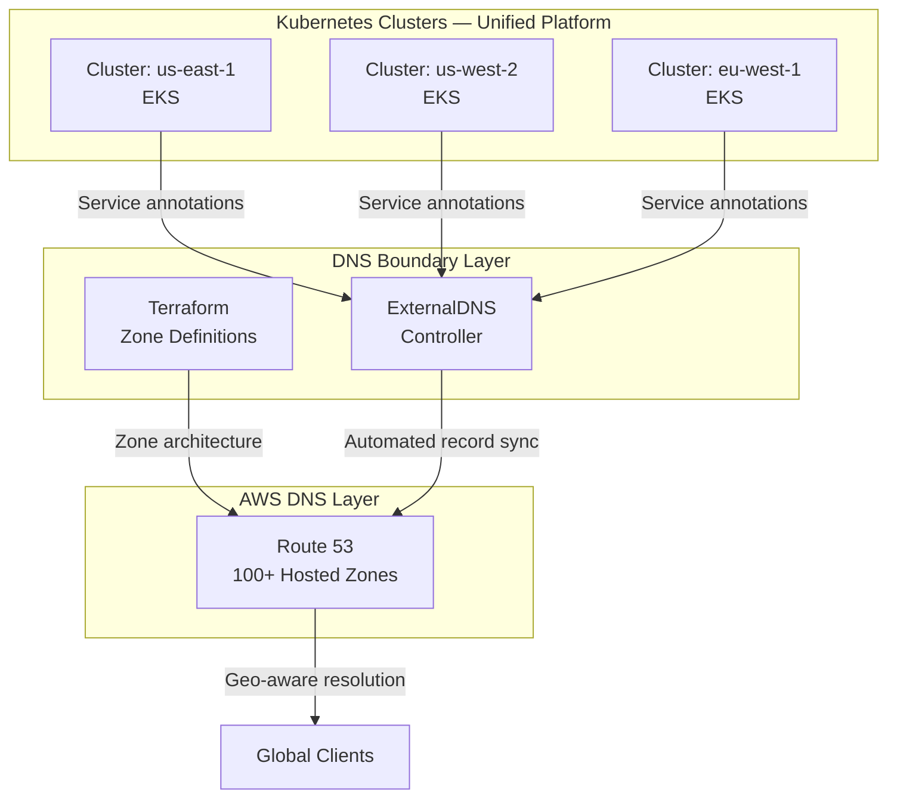

import CaseStudyHeader from '@site/src/components/CaseStudyHeader';

CASE STUDY — 02

# Twilio-wide DNS Modernization

<CaseStudyHeader
  number="02 / 03"
  role="Staff Software Engineer — Platform Lead"
  duration="2023 – 2024"
  stack={['Route53', 'Terraform', 'ExternalDNS', 'AWS EKS', 'Helm', 'Python']}
  impact="Eliminated 80% of DNS-related toil and enabled Twilio's Kubernetes platform to scale across regions without DNS as a bottleneck."
/>

  How replacing fragmented, ticket-driven DNS management with an agnostic, code-defined boundary
  eliminated 80% of operational burnout and enabled Twilio's unified Kubernetes platform to scale
  across regions without DNS as a bottleneck.

  

    100+
    Hosted Zones Managed
  

  

    80%
    Ops Burnout Reduced
  

  

    0
    Manual DNS Interventions
  

  

    3+
    AWS Regions Covered
  

---

The Challenge

## DNS as an Organizational Bottleneck

The platform unification initiative aimed to unify hundreds of services under a common Kubernetes platform.
DNS was the hidden blocker. The existing state:

- **Manual record management** — every new service, cluster migration, or region expansion
  required a ticket and human intervention.
- **Brittle multi-cluster discovery** — services in `us-east-1` couldn't reliably resolve
  services in `us-west-2` without custom, error-prone workarounds.
- **No namespace isolation** — DNS changes in one domain could silently break another.
- **Audit impossibility** — no code-of-record for what DNS state *should* be, only what it *was*.

The on-call rotation was spending a disproportionate amount of time on DNS incidents.
The root cause was structural: DNS was treated as an operational task, not a platform capability.

---

Architecture

## The Centralized DNS Boundary

---

Strategic Solution

## Decoupling Service Discovery from Cluster Identity

The architectural principle was **agnosticism**: the DNS boundary should not know or care
which specific cluster a service lives in. This enabled cluster migrations and regional
failovers without any DNS changes on the client side.

**The ExternalDNS controller** was configured with organizational conventions so that
a Kubernetes `Service` or `Ingress` with the right annotations would automatically
create, update, and delete its own DNS records across all relevant hosted zones.
No tickets. No manual steps.

**Terraform zone architecture** defined the hosted zone structure, delegation chains,
and IAM governance as code — giving the platform team full auditability and the ability
to evolve the DNS topology through pull requests, not support requests.

**Namespace-scoped permissions** ensured that domain teams could manage their own records
within their allocated zones, but could not affect records belonging to other domains.
Self-service without blast radius.

---

Organizational Impact

## What Changed

| Workflow | Before | After |
|---|---|---|
| New service DNS record | Ticket → wait → manual entry | Service annotation → auto-synced |
| Cluster migration | Multi-day DNS coordination | Transparent to all consumers |
| Multi-region expansion | Manual replication per region | Single controller, all regions |
| On-call DNS incidents | Weekly occurrence | Near-zero |

The **80% reduction in operational burnout** was measured through on-call incident
frequency before and after the rollout. Engineers reclaimed time previously spent
on DNS firefighting and redirected it to platform improvements.

---

Technical Implementation

## Stack

- **Service Discovery** — Kubernetes ExternalDNS (custom configuration per cluster)
- **Cloud DNS** — Amazon Route 53 (100+ hosted zones, geo-routing policies)
- **IaC** — Terraform for zone architecture, delegation, and IAM boundary
- **Governance** — AWS IAM + IRSA (IAM Roles for Service Accounts) for namespace-scoped access
- **Multi-Region** — Route 53 health checks + latency-based routing for active-active resolution
