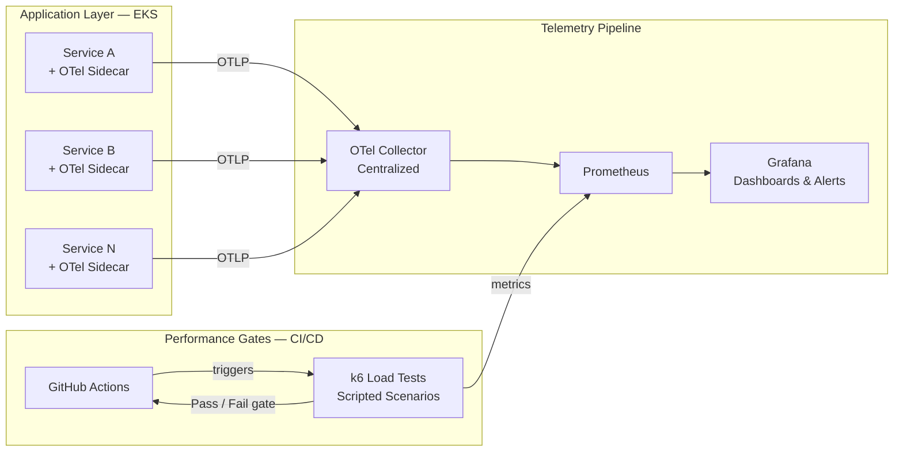

import CaseStudyHeader from '@site/src/components/CaseStudyHeader';

CASE STUDY — 03

# Automated Observability & Load Testing

<CaseStudyHeader
  number="03 / 03"
  role="Staff Software Engineer — Platform Lead"
  duration="2023 – 2024"
  stack={['OpenTelemetry', 'k6', 'Grafana', 'Prometheus', 'GitHub Actions', 'AWS EKS']}
  impact="Transformed platform reliability from reactive incident response to proactive, data-driven performance engineering with automated CI/CD gates."
/>

  How standardizing on OpenTelemetry and integrating k6 as a CI/CD performance gate transformed
  platform reliability — moving from reactive incident response to proactive, data-driven
  performance engineering.

  

    100%
    Observability Coverage
  

  

    15+
    Bottlenecks Found Pre-Prod
  

  

    0
    Surprise Production Outages
  

  

    Helm
    Sidecar Distribution
  

---

The Challenge

## Blind Spots at Scale

Observability across the Twilio Kubernetes platform was fragmented by design — or rather,
by the absence of one. The consequences were predictable:

- **Heterogeneous monitoring** — some teams used Prometheus, others proprietary APM tools,
  others nothing at all. Cross-service incident correlation was nearly impossible.
- **Load testing as an event** — performance tests happened once, manually, days before a
  major release. Regressions introduced between releases went undetected until production.
- **Reactive incident response** — without consistent telemetry, on-call engineers were
  debugging by intuition rather than data.
- **No shared baseline** — SLO definitions varied by team, making platform-wide reliability
  reporting meaningless.

The problem was cultural as much as technical: performance was not built into the delivery process.

---

Architecture

## The Unified Telemetry Pipeline

---

Strategic Solution

## Two Pillars: Unify and Shift Left

**Pillar 1: Unified Instrumentation via OpenTelemetry**

The key decision was adopting OTel as a *sidecar*, not as a library teams had to integrate.
By delivering observability via Helm charts, we removed the per-team instrumentation burden entirely.
Every service running the sidecar automatically exported:

- **Metrics** — request rate, error rate, latency (RED) via OTel Collector → Prometheus
- **Traces** — distributed traces across service boundaries via OTel → Jaeger/Tempo
- **Logs** — structured log correlation with trace context

No code changes required from application teams.

**Pillar 2: Shift-Left Performance with k6**

Performance tests were redesigned as *gates* in the CI/CD pipeline, not post-deployment checks.
Each service's delivery pipeline included:

1. A baseline load test that ran on every PR merge to the main branch.
2. Threshold assertions (p95 latency, error rate, throughput) that blocked deployment if breached.
3. Trend reporting into the same Prometheus/Grafana stack for longitudinal analysis.

The cultural shift: performance regressions were now caught by the engineer who introduced them,
not by the on-call engineer three weeks later.

---

Organizational Impact

## What Changed

| Dimension | Before | After |
|---|---|---|
| Observability coverage | Inconsistent, team-dependent | 100% for critical services |
| Performance testing cadence | Pre-release event | Every PR merge |
| Production bottlenecks found | Post-incident | Pre-deployment (15+ caught) |
| Cross-service correlation | Manual, slow | Automated via trace context |
| SLO visibility | Per-team silos | Unified Grafana platform view |

The transition from reactive to proactive performance engineering measurably reduced
incident frequency and mean-time-to-detection across the platform.

---

Technical Implementation

## Stack

- **Instrumentation** — OpenTelemetry Collector (sidecar deployment via Helm)
- **Metrics** — Prometheus + Grafana (dashboards, alerts, SLO tracking)
- **Load Testing** — k6 (scripted scenarios, threshold-based CI gates)
- **Packaging** — Helm shared library for sidecar distribution
- **CI/CD** — GitHub Actions (performance gates on every merge)
- **Tracing** — OTel → Tempo/Jaeger for distributed trace correlation
